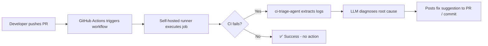
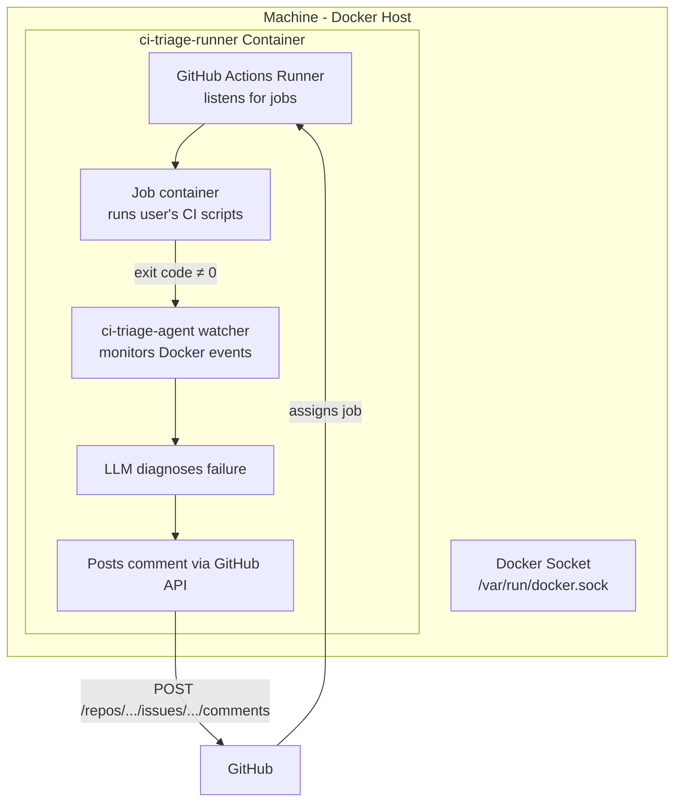
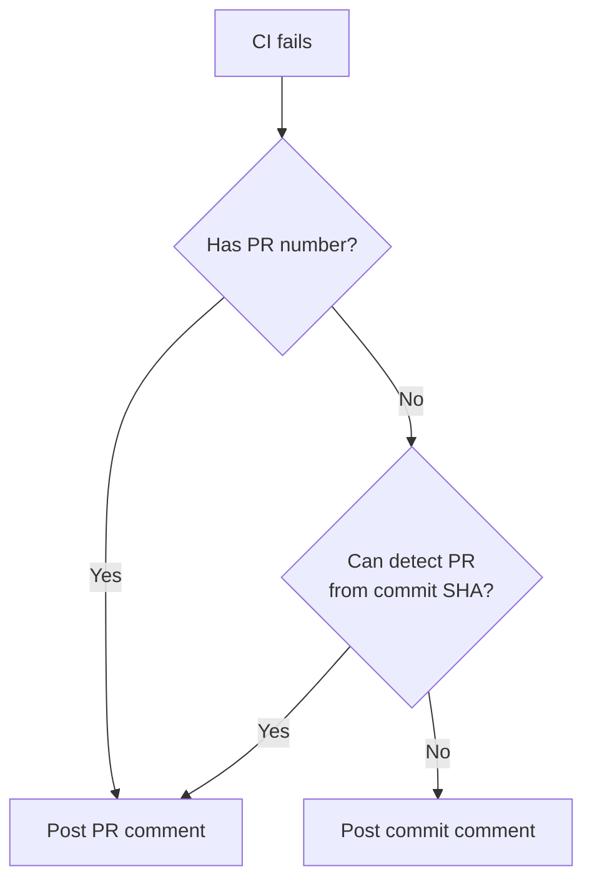

# CI Triage Agent

AI-driven CI failure & bug triage agent. Deploys as a **self-hosted GitHub Actions runner** with Docker-in-Docker. When CI fails, it automatically diagnoses the root cause and posts a fix suggestion as a commit or PR comment.



## How It Works



```
┌──────────────────────────────────────────────────────────────────────┐
│  Developer pushes PR ───────────────→ CI fails ──────────────────────┤
│  ci-triage-agent extracts build log → calls LLM → posts to PR/commit │
└──────────────────────────────────────────────────────────────────────┘
```

```
┌───────────────────────────────────────────────────────────────────────┐
│  HOST MACHINE                                                         │
│                                                                       │
│  ┌───────────────────────────────────────────────────────────┐        │
│  │  ci-triage-runner (Docker container)                      │        │
│  │                                                           │        │
│  │  ┌──────────────────────┐  ┌────────────────────────────┐ │        │
│  │  │  GitHub Runner       │  │  ci-triage-agent watcher   │ │        │
│  │  │  (unmodified)        │  │  (Python daemon)           │ │        │
│  │  │                      │  │                            │ │        │
│  │  │  Listens for jobs    │  │  docker events --filter    │ │        │
│  │  │  from GitHub         │  │  'event=die'               │ │        │
│  │  └─────────┬───────────┘  │                             │ │        │
│  │            │              │  → inspect container        │ │        │
│  │            │              │  → docker logs --tail 200   │ │        │
│  │            │              │  → call LLM API             │ │        │
│  │            │              │  → POST comment to PR       │ │        │
│  │            │              └──────────┬──────────────────┘ │        │
│  └────────────┼─────────────────────────┼────────────────────┘        │
│               │                         │                             │
│               ▼                         │                             │
│  ┌─────────────────────────┐            │                             │
│  │  Job Container           │           │                             │
│  │  (user's CI scripts)     │           │                             │
│  │                          │           │                             │
│  │  Runs: pytest, build,    │           │                             │
│  │  lint, etc.              │           │                             │
│  │                          │           │                             │
│  │  Env: GITHUB_ACTIONS=true│           │                             │
│  │       GITHUB_REPOSITORY=X│           │                             │
│  └──────────┬───────────────┘           │                             │
│             │                           │                             │
│             └── exits with code ≠ 0 ────┘                             │
│                                                                       │
│  Docker Socket (/var/run/docker.sock)                                 │
└───────────────────────────────────────────────────────────────────────┘
```

## Screenshots

### Commit Comment
<!-- TODO: Insert screenshot of bot posting a diagnosis on a commit -->


### PR Comment
<!-- TODO: Insert screenshot of bot posting a diagnosis on a PR -->


## Quick Start

### Prerequisites

- A machine with Docker installed
- A GitHub repository with Actions enabled
- An LLM API key (Gemini / OpenAI / Anthropic)

### Step 1 — Get an LLM API Key

| Provider | Where to get it |
|----------|----------------|
| **Gemini** | [Google AI Studio](https://aistudio.google.com/apikey) |
| **OpenAI** | [OpenAI Platform](https://platform.openai.com/api-keys) |
| **Anthropic** | [Anthropic Console](https://console.anthropic.com/) |

### Step 2 — Build the runner image

```bash
git clone https://github.com/your-org/PR-review-ai-tool.git
cd PR-review-ai-tool
sudo docker build -t ci-triage-runner-github:latest -f runner-github/Dockerfile .
```

### Step 3 — Register and run

1. Go to your repo: **Settings → Actions → Runners → New runner**
2. Copy the registration token
3. Run the container:

```bash
sudo docker run -d \
  --name ci-triage-runner \
  --restart unless-stopped \
  --privileged \
  -e GITHUB_OWNER=your-org \
  -e GITHUB_REPO=your-repo \
  -e RUNNER_TOKEN=<token-from-step-2> \
  -e GH_TOKEN=<github-pat-with-repo-scope> \
  -e LLM_API_KEY=<your-llm-api-key> \
  -e LLM_PROVIDER=gemini \
  -e DOCKER_HOST=unix:///var/run/docker.sock \
  -v /var/run/docker.sock:/var/run/docker.sock \
  ci-triage-runner-github:latest
```

### Step 4 — Add the workflow to your repo

Create `.github/workflows/ci-triage.yml` in your repository:

```yaml
name: CI Triage Agent

"on":
  push:
  pull_request:
    types: [opened, synchronize]
  workflow_dispatch:

permissions:
  contents: write
  pull-requests: write

jobs:
  test:
    runs-on: [self-hosted, ci-triage]
    steps:
      - uses: actions/checkout@v4
      - name: Run tests
        run: |
          # Your test commands here
          pytest || exit 1
      - name: Upload build log
        if: failure()
        uses: actions/upload-artifact@v4
        with:
          name: build-log
          path: build.log
          retention-days: 1

  triage:
    if: failure()
    needs: [test]
    runs-on: [self-hosted, ci-triage]
    permissions:
      contents: write
      pull-requests: write
    steps:
      - uses: actions/checkout@v4
      - name: Download build log
        uses: actions/download-artifact@v4
        with:
          name: build-log
      - name: Install ci-triage-agent
        run: pip install .
      - name: Run AI Triage
        env:
          LLM_PROVIDER: ${{ vars.LLM_PROVIDER || 'gemini' }}
          GITHUB_TOKEN: ${{ secrets.GITHUB_TOKEN }}
          REPO_OWNER: ${{ github.repository_owner }}
          REPO_NAME: ${{ github.event.repository.name }}
          PR_NUMBER: ${{ github.event.pull_request.number }}
          COMMIT_SHA: ${{ github.sha }}
          LOG_LINES: "200"
          LLM_TIMEOUT: "60"
        run: ci-triage-agent --log-file build.log
```

That's it. The runner will:
1. Connect to GitHub
2. Pick up CI jobs labeled `self-hosted` + `ci-triage`
3. When a job fails → triage job runs → AI posts diagnosis to PR or commit

### How routing works



## Local Testing

### Test the triage pipeline (CLI)

```bash
pip install -e .

export LLM_API_KEY="your-key"

# Test with a sample log — calls LLM and prints diagnosis
ci-triage-agent --print --log-file tests/fixtures/sample_error_log.txt

# Test with a live failure
python -c "x = undefined_name" 2>&1 | ci-triage-agent --print

# See the prompt without calling LLM (dry-run)
ci-triage-agent --dry-run --log-file tests/fixtures/sample_error_log.txt
```

### Test the watcher

```bash
# Dry-run mode (won't call LLM or post)
python -m ci_triage_agent.watcher --dry-run

# In another terminal, simulate a CI container failure:
docker run --rm -e GITHUB_ACTIONS=true \
  -e GITHUB_REPOSITORY=test/test \
  -e GITHUB_REF=refs/pull/1/head \
  alpine sh -c "echo 'test error' && exit 1"
```

## Architecture

```
src/ci_triage_agent/
├── __init__.py
├── __main__.py        # CLI entry point
├── cli.py              # Argument parsing & orchestration
├── config.py           # Environment variable config
├── log_extractor.py    # Extract last N lines from error log
├── prompt_builder.py   # Build zero-shot LLM prompt
├── llm_client.py       # Provider-agnostic LLM (Gemini/OpenAI/Anthropic)
├── response_parser.py  # Parse Markdown → root cause + code patch
├── ci_client.py        # Post comment to PR / commit (GitHub + Forgejo API)
└── watcher.py          # Docker event watcher daemon

runner-github/
├── Dockerfile           # DinD runner image
├── dind-entrypoint.sh   # Starts dockerd + watcher + runner
├── configure.sh         # Runner registration helper
└── entrypoint.sh        # Non-DinD entrypoint
```

## Configuration

### Agent environment variables

| Variable | Default | Required | Description |
|----------|---------|----------|-------------|
| `LLM_API_KEY` | — | ✅ | Gemini / OpenAI / Anthropic API key |
| `LLM_PROVIDER` | `gemini` | — | `gemini`, `openai`, or `anthropic` |
| `GITHUB_TOKEN` | — | ✅ | GitHub token for posting comments |
| `GH_TOKEN` | — | — | Fallback for GITHUB_TOKEN |
| `REPO_OWNER` | — | ✅ | GitHub repo owner |
| `REPO_NAME` | — | ✅ | GitHub repo name |
| `PR_NUMBER` | — | — | PR number (auto-detected for PR events) |
| `COMMIT_SHA` | — | — | Commit SHA (auto-detected) |
| `LOG_LINES` | `200` | — | Log lines to analyze |
| `LLM_TIMEOUT` | `60` | — | LLM API timeout (seconds) |
| `LLM_MAX_RETRIES` | `3` | — | Retries on transient API errors |
| `LOG_LEVEL` | `INFO` | — | `DEBUG`, `INFO`, `WARNING`, `ERROR` |

### Runner container environment variables

| Variable | Required | Description |
|----------|----------|-------------|
| `GITHUB_OWNER` | ✅ | GitHub org/user that owns the repo |
| `GITHUB_REPO` | ✅ | Repository name |
| `RUNNER_TOKEN` | ✅ | Runner registration token from GitHub |
| `GH_TOKEN` | ✅ | GitHub PAT with `repo` scope |
| `LLM_API_KEY` | ✅ | LLM provider API key |
| `LLM_PROVIDER` | — | LLM provider (default: `gemini`) |
| `CI_TRIAGE_WATCHER` | — | Set to `true` to enable watcher daemon |
| `GITHUB_ACTIONS_RUNNER` | — | Set to `true` to enable runner |

## Development

```bash
python3 -m venv .venv
source .venv/bin/activate
pip install -e ".[dev]"
pytest
```

## Production Deployment

### Monitor the runner

```bash
# Live logs
sudo docker logs ci-triage-runner --follow

# Check status
sudo docker ps --filter name=ci-triage-runner

# Resource usage
sudo docker stats ci-triage-runner --no-stream
```

### Rolling update

```bash
sudo docker build -t ci-triage-runner-github:latest -f runner-github/Dockerfile .
sudo docker rm -f ci-triage-runner
sudo docker run -d \
  --name ci-triage-runner \
  --restart unless-stopped \
  --privileged \
  -e GITHUB_OWNER=your-org \
  -e GITHUB_REPO=your-repo \
  -e RUNNER_TOKEN=<fresh-token> \
  -e GH_TOKEN=<pat> \
  -e LLM_API_KEY=<key> \
  -e LLM_PROVIDER=gemini \
  -e DOCKER_HOST=unix:///var/run/docker.sock \
  -v /var/run/docker.sock:/var/run/docker.sock \
  ci-triage-runner-github:latest
```

## Forgejo / Gitea Setup

The same agent also works with Forgejo / Gitea Actions. Set `GITEA_TOKEN` and `FORGEJO_URL` instead of `GITHUB_TOKEN`. The agent auto-detects the provider.

## Security

- API keys injected via environment variables only — never written to disk
- The agent is **read-only** — it never modifies code, only reads logs and posts comments
- LLM responses are validated before posting (must contain expected sections)
- Bot token scoped to minimal permissions
- The watcher only inspects containers with `CI_PROVIDER` labels — ignores unrelated containers

## FAQ

**Q: Does this work with GitHub Actions?**  
Yes. The default setup uses GitHub Actions with a self-hosted runner.

**Q: Does this work with Forgejo / Gitea?**  
Yes. Set `GITEA_TOKEN` and `FORGEJO_URL` instead of `GITHUB_TOKEN`.

**Q: What if the LLM is wrong?**  
The agent posts as a bot comment — it's advisory. Developers review and decide.

**Q: What if the runner machine goes offline?**  
Jobs queue on GitHub and run when the machine comes back. The container auto-starts if Docker is configured with `--restart unless-stopped`.

**Q: What if the runner can't reach the internet?**  
The LLM API requires internet access. For air-gapped setups, deploy a local Ollama instance.

**Q: Does every repo need setup?**  
The runner is registered once per repo. The workflow YAML must be present in each repo that wants triage.
